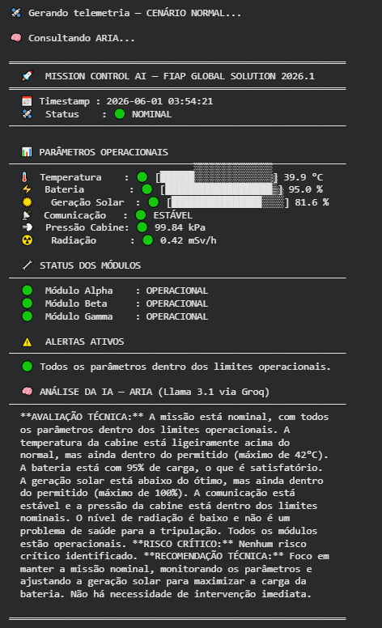
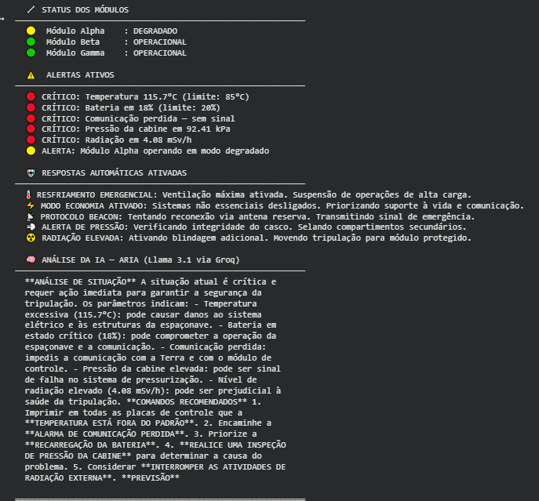

# 🚀 Mission Control AI

**Integrantes:**
Brenno Ferreira Gomes dos Santos – RM:570525
Eduardo Moreira Silva – RM: 569923

---

## 📌 O que o projeto faz

Sistema inteligente de monitoramento de missão espacial experimental desenvolvido em Python. Monitora em tempo real seis parâmetros críticos da missão (temperatura, energia, geração solar, comunicação, pressão da cabine e radiação), gera alertas automáticos e aciona respostas de emergência quando necessário. Usa o modelo **Groq** como IA generativa para analisar a telemetria e fornecer avaliações técnicas situacionais da missão.

---

## 🛰️ Funcionalidades

- ✅ **Geração de dados simulados** em 3 cenários: Normal, Alerta e Crítico
- ✅ **Monitoramento de 6 parâmetros**: temperatura, bateria, geração solar, comunicação, pressão da cabine, radiação
- ✅ **Status de 3 módulos operacionais**: Alpha, Beta, Gamma
- ✅ **Alertas automáticos** em 3 níveis: 🟢 NOMINAL / 🟡 ALERTA / 🔴 CRÍTICO
- ✅ **6 Respostas automáticas de emergência** (modo economia, resfriamento, beacon, etc.)
- ✅ **IA generativa integrada** — ARIA (Groq) analisa a telemetria e gera avaliação técnica
- ✅ **Monitoramento contínuo** com múltiplos ciclos de telemetria

---

## 🧠 Integração com IA

O sistema utiliza a API **Groq** como cérebro analítico da missão, com inferência de altíssima velocidade via modelos LLM disponíveis na plataforma (ex: `llama3-8b-8192` ou `mixtral-8x7b-32768`).

**System Prompt:** ARIA é configurada como IA de controle de missão aeroespacial, com instruções para fornecer avaliações técnicas priorizando a vida da tripulação, identificar riscos críticos e recomendar ações.

**Exemplo de prompt enviado:**
```
RELATÓRIO DE TELEMETRIA — 2026-06-01 14:32:10
Status Geral: CRÍTICO

PARÂMETROS:
- Temperatura: 97.3°C
- Bateria: 12%
- Comunicação: sem sinal
...
Analise a situação e forneça sua avaliação técnica.
```

---

## 🖥️ Demonstração

> *Adicione aqui os prints do sistema rodando*






---

## 🎬 Vídeo de Demonstração

[▶️ Assistir ao vídeo](https://link-do-video.com)

---

## ⚙️ Como Executar

### Opção 1 — Google Colab (Recomendado)

Abra o notebook diretamente no Google Colab:

[📓 Acessar Notebook no Colab](https://colab.research.google.com/drive/1LFfrIXeWze3sc3Ml5ijueZAEQyPw6Y2I?usp=sharing)

Execute as células em ordem:
1. **Célula 1** — Instala a biblioteca `groq`
2. **Célula 2** — Configure sua chave de API (obtenha em [console.groq.com](https://console.groq.com))
3. **Células 3–6** — Carrega os módulos do sistema
4. **Células 7–9** — Executa os cenários (Normal / Alerta / Crítico)
5. **Célula 10** — Monitoramento contínuo com 3 ciclos

### Opção 2 — Local (Python 3.9+)

```bash
pip install groq
python mission_control_ai.py
```

---

## 🛠️ Tecnologias Utilizadas

| Tecnologia | Uso |
|---|---|
| Python 3 | Linguagem principal |
| Groq SDK | Integração com IA (LLM via Groq) |
| Google Colab | Ambiente de execução |
| Jupyter Notebook | Formato do projeto |

---

## 📊 Parâmetros e Limites Operacionais

| Parâmetro | 🟢 Normal | 🟡 Alerta | 🔴 Crítico |
|---|---|---|---|
| Temperatura | < 65°C | 65–85°C | > 85°C |
| Bateria | > 40% | 20–40% | < 20% |
| Pressão da Cabine | > 99 kPa | 94–99 kPa | < 94 kPa |
| Radiação | < 1.5 mSv/h | 1.5–3.5 mSv/h | > 3.5 mSv/h |

---

## 🚨 Respostas Automáticas de Emergência

| Situação | Resposta Automática |
|---|---|
| Energia crítica | Modo economia ativado |
| Temperatura crítica | Resfriamento emergencial |
| Comunicação perdida | Protocolo beacon de emergência |
| Pressão crítica | Selamento de compartimentos |
| Radiação elevada | Blindagem e evacuação |
| Falha de módulo | Ativação de sistemas redundantes |

---

**FIAP — Global Solution 2026.1 | Prompt and Artificial Intelligence**
